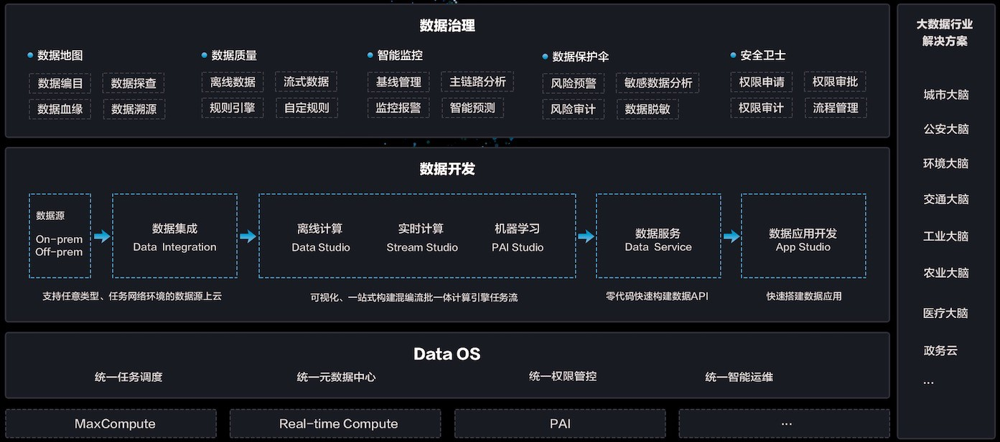

# markdown基本语法

# 一、标题
# 1级标题  
## 2级标题  
### 3级标题  
#### 4级标题  
##### 5级标题   
###### 6级标题  

# 二、分割线  

分割线  
---
***
***  

# 三、链接  
  
[百度](www.baidu.com)  
[链接到百度][1]  
[链接到Google][2]    
[还是链接到百度][1]   
直接链接：<https://www.mdeditor.com>  


[1]:https://www.baidu.com  
[2]:https://www.google.com   

# 四、字体设置及列表
- **加粗**  
- *斜体*  
- **_加粗斜体_**  
- ***加粗斜体***
- ~~删除线~~  

#### 无序列表（减号）Unordered Lists (-)

- 列表一
- 列表二
- 列表三

#### 无序列表（星号）Unordered Lists (*)

* 列表一
* 列表二
* 列表三

#### 无序列表（加号和嵌套）Unordered Lists (+)
+ 列表一
+ 列表二
    * 列表二-1
    + 列表二-2
    + 列表二-3
+ 列表三
    * 列表一
    * 列表二
    * 列表三

#### 有序列表 Ordered Lists (-)

1. 第一行
2. 第二行
3. 第三行

#### GFM task list

- [x] GFM task list 1
- [x] GFM task list 2
- [ ] GFM task list 3
    - [ ] GFM task list 3-1
    - [ ] GFM task list 3-2
    - [ ] GFM task list 3-3
- [ ] GFM task list 4
    - [ ] GFM task list 4-1
    - [ ] GFM task list 4-2   


# 五、代码
- 单个代码`ctrl + v`  
- 代码段  


```
import pandas
import numpy 
import re 
```

# 六、文字引用及表情  
*   Lorem ipsum dolor sit amet, consectetuer adipiscing elit.
Aliquam hendrerit mi posuere lectus. Vestibulum enim wisi,
viverra nec, fringilla in, laoreet vitae, risus.
@@ -31,36 +51,11 @@ viverra nec, fringilla in, laoreet vitae, risus.
consectetuer adipiscing elit. Aliquam hendrerit mi posuere lectus.
Vestibulum enim wisi, viverra nec, fringilla in, laoreet vitae, risus.

<br/> 
表情1：:+1:  
表情2：:o:


### 星火在线1对1学习管理部表格   
# 七、表格
### 星火在线1对1学习管理部表格     


| 项目        | 价格   |  数量  |
| --------   | -----:  | :----:  |
| 计算机      | $1600   |   5     |
| 手机        |   $12   |   12   |
| 管线        |    $1    |  234  |

First Header  | Second Header
------------- | -------------
Content Cell  | Content Cell
Content Cell  | Content Cell

| First Header  | Second Header |
| ------------- | ------------- |
| Content Cell  | Content Cell  |
| Content Cell  | Content Cell  |

| Function name | Description                    |
| ------------- | ------------------------------ |
| `help()`      | Display the help window.       |
| `destroy()`   | **Destroy your computer!**     |

| Left-Aligned  | Center Aligned  | Right Aligned |
| :------------ |:---------------:| -----:|
| col 3 is      | some wordy text | $1600 |
| col 2 is      | centered        |   $12 |
| zebra stripes | are neat        |    $1 |

| Item      | Value |
| --------- | -----:|
| Computer  | $1600 |
| Phone     |   $12 |
| Pipe      |    $1 |
